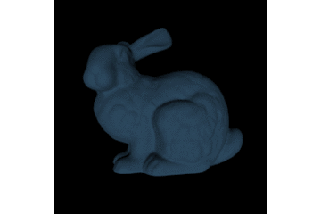
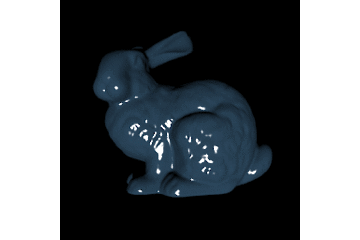
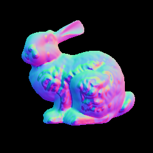
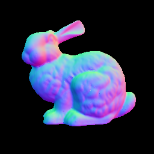

# Robust Photometric Stereo in Python

written by Yasuyuki Matsushita (yasumat@ist.osaka-u.ac.jp) supported 
by Osaka University and JSPS KAKENHI Grant Number JP16H01732, Japan

based on a part of robust photometric stereo works in 2010-2018 conducted at Microsoft Research Asia and Osaka University
together with external collaborators listed in the publication list below.


### What is Photometric Stereo?

Photometric Stereo is an approach to determining surface normal of 
a scene from a set of images recorded from a fixed viewpoint but under
varying lighting conditions, originally proposed by Woodham [1].
<p align="center">
 &rarr; 
</p>

### What is *Robust* Photometric Stereo?

Conventional Photometric Stereo is based on least-square regression (or L2 residual minimization), 
which is susceptible to large *outliers*. For example, when a Lambertian reflectance and local illumination model 
are assumed, specular high-lights and cast shadows are regarded as outliers, causing inaccurate estimates of 
surface normal.
<p align="center">
 &rarr; 
</p>

Robust Photometric Stereo effectively disregards such outliers based on *sparse* regression. 
This code implements robust photometric stereo based on:
* L1 residual minimization
* Sparse Bayesian learning
* Robust Principal Component Analysis (RPCA)

This software implementation also includes a conventional L2 residual minimization (or least-squares) method.

Input | Ground Truth | L2 | L1 | SBL | RPCA
--- | --- | --- | --- | --- | ---
 |  |  |  |  |  

### How to use?

Download this package and run the demo code:
```
python demo.py
```

To switch the solver, look into `demo.py` and choose any of the following one when calling `RPS.solve()`
    
    RPS.L2_SOLVER    # Conventional least-squares
    RPS.L1_SOLVER    # L1 residual minimization
    RPS.L1_SOLVER_MULTICORE    # L1 residual minimization (multicore)
    RPS.SBL_SOLVER    # Sparse Bayesian Learning
    RPS.SBL_SOLVER_MULTICORE    # Sparse Bayesian Learning (multicore)
    RPS.RPCA_SOLVER    # Robust PCA

### Conditions of use

This package is distributed under the GNU General Public License. For
information on commercial licensing, please contact the authors at the
contact address below. If you use this code for a publication, please
consider citing the following papers:


    @inproceedings{RPS2010,
	  	title={Robust Photometric Stereo via Low-Rank Matrix Completion and Recovery},
	  	author={Lun Wu, Arvind Ganesh, Boxin Shi, Yasuyuki Matsushita, Yongtian Wang, and Yi Ma},
	  	booktitle={Proceedings of Asian Conference on Computer Vision (ACCV)},
	  	year={2010}
	}

    @inproceedings{RPS2012,
	  	title={Robust Photometric Stereo using Sparse Regression},
	  	author={Satoshi Ikehata, David Wipf, Yasuyuki Matsushita, and Kiyoharu Aizawa},
	  	booktitle={Proceedings of Computer Vision and Pattern Recognition (CVPR)},
	  	year={2012}
	}

    @article{RPS2014pami,
        	title={Photometric Stereo Using Sparse Bayesian Regression for General Diffuse Surfaces},
        	author={Satoshi Ikehata, David P. Wipf, Yasuyuki Matsushita, and Kiyoharu Aizawa},
        	journal={IEEE Transactions on Pattern Analysis and Machine Intelligence (TPAMI)},
        	volume={36},
        	number={9},
        	pages={1078--1091},
        	year={2014}
    }

### Dependencies
The code is written in Python 3.6 but should be able to adapt it to Python 2.x if needed.
You might need the following Python packages installed:
* `cv2` (OpenCV, used for image I/O)
* `glob` (used for reading out a list of images)
* `numpy` (main computation depends on matrix operations)
* `sklearn` (scikit-learn, used for normalization of array)


### Acknowledgements

This code implementation work is supported by Osaka University and JSPS KAKENHI Grant
Number JP16H01732, Japan.


### Contact information

Questions / Comments? Bug reports? Please contact Yasuyuki Matsushita at yasumat@ist.osaka-u.ac.jp.


### References

[1] Woodham, R.J. Photometric method for determining surface orientation from multiple images. 
Optical Engineerings 19, I, 139-144, 1980

